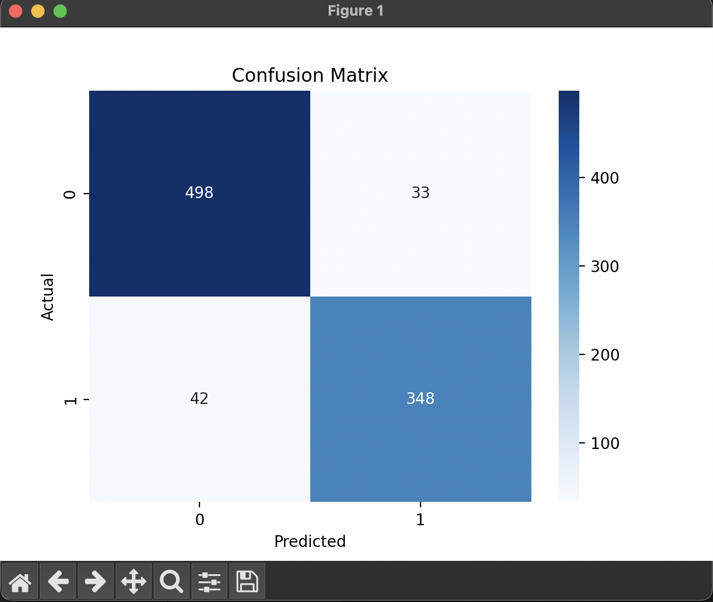
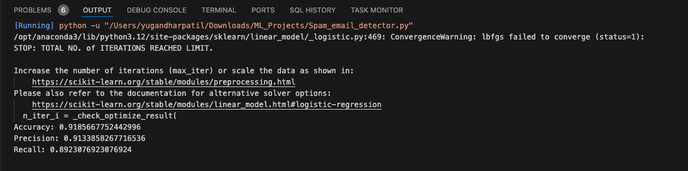

# 📧 Spam Email Classification using Logistic Regression

This project demonstrates a simple Machine Learning pipeline to classify emails as spam or not spam using a Logistic Regression model.

---

## 📂 Project Structure

- `spam.csv` – The dataset (must include a `'spam'` column as target label).
- `spam_classifier.py` – Python script to train and evaluate the model.
- `README.md` – Documentation of the project.

---

## 🧰 Requirements

Install the required packages with:

```bash
pip install pandas scikit-learn seaborn matplotlib
```



